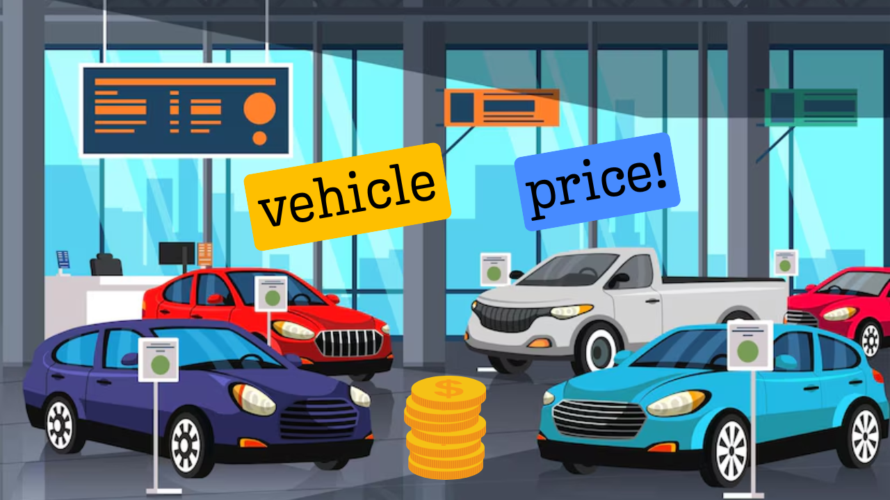

# Vehicle Price & Category Predictor App

This app predicts the price of a vehicle and classifies it into categories (low, medium, high)
based on user inputs, using pretrained machine learning models.

## Dependencies:
- pandas
- joblib
- scikit-learn
- customtkinter

## Install dependencies via:
    pip install pandas joblib scikit-learn customtkinter

## Files needed in the same directory:
- vehicle_price_model.pkl           (trained regression model)
- vehicle_price_classifier.pkl      (trained classification model)
- model_columns.pkl                 (list of columns for one-hot encoding)
- process_data.csv                  (dataset used to generate input fields)

## Run:
    python app.py

## Usage:
- Enter values for each vehicle feature.
- Click "Predict" to get predicted price and price category.
